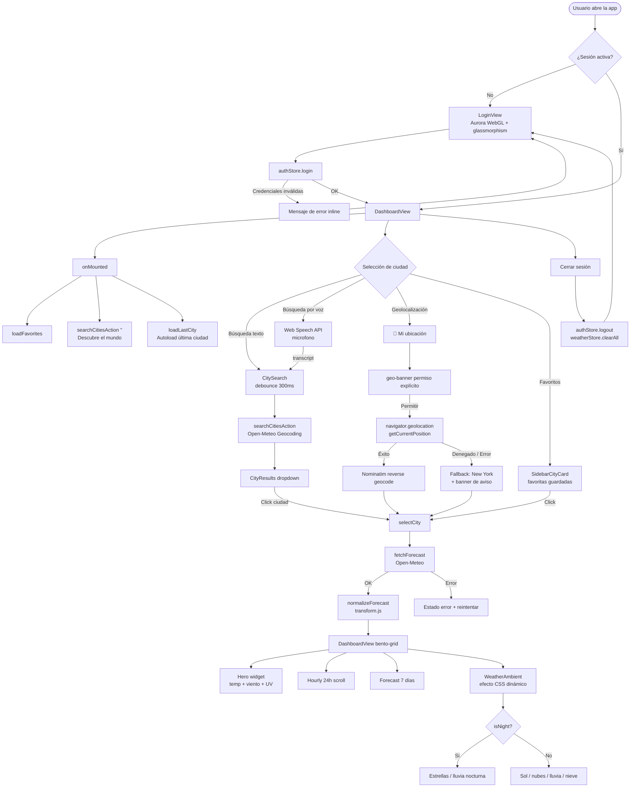

# ClimaApp 🌤️

App del clima con autenticación, búsqueda de ciudades por API, pronóstico 7 días + 24 horas, favoritos, efectos ambientales CSS y accesibilidad WCAG AA.

## 🛠️ Stack

| Tecnología        | Versión | Uso                                          |
| ----------------- | ------- | -------------------------------------------- |
| Vue 3             | ^3.5    | Framework UI (Composition API)               |
| Vite              | ^7.3    | Build tool + dev server                      |
| Vue Router 4      | ^4      | Rutas + navigation guard                     |
| Pinia             | ^3      | Stores reactivos                             |
| OGL               | latest  | WebGL para efecto Aurora en login            |
| Web Speech API    | —       | Búsqueda por voz (nativa, sin dependencias)  |
| Fetch API         | —       | Requests HTTP                                |
| CSS               | —       | Estilos propios + design tokens              |

## 🔑 Credenciales Demo

```
Usuario: profe
Contraseña: 1234
```

## 🌐 APIs Utilizadas

| API                    | Uso                                          | Auth |
| ---------------------- | -------------------------------------------- | ---- |
| Open-Meteo Geocoding   | Búsqueda de ciudades por nombre              | Sin key |
| Open-Meteo Forecast    | Pronóstico diario: temp, clima, viento, UV   | Sin key |
| Nominatim (OSM)        | Geocodificación inversa para geolocalización | Sin key |

## 🗺️ Flujo de la Aplicación



## 📁 Arquitectura

```
src/
├── components/
│   ├── AppLogo.vue           # Logo SVG (sol + nube), reutilizable en login y sidebar
│   ├── AuroraBackground.vue  # Efecto aurora WebGL (portado de vue-bits, requiere ogl)
│   ├── ShinyText.vue         # Texto con brillo deslizante (portado de vue-bits)
│   ├── WeatherAmbient.vue    # Efectos CSS animados por condición climática (GPU-only)
│   ├── CitySearch.vue        # Input búsqueda: debounce 300ms + micrófono Web Speech API
│   ├── CityResults.vue       # Resultados: dropdown búsqueda + "Descubre el mundo"
│   ├── SidebarCityCard.vue   # Tarjeta rica: reloj local, temp, condición, WeatherAmbient
│   ├── WeatherCard.vue       # Fila del pronóstico 7 días
│   ├── UiAlert.vue           # Alertas accesibles (error/info/success/warning)
│   └── LoadingSkeleton.vue   # Skeleton animado para estados de carga
├── views/
│   ├── LoginView.vue         # Login: AppLogo + glassmorphism + fondo Aurora WebGL
│   └── DashboardView.vue     # Dashboard: sidebar + bento grid + WeatherAmbient fullscreen
├── stores/
│   ├── auth.store.js         # Auth + persistencia localStorage
│   └── weather.store.js      # Clima, favoritos, lastCity, geolocalización, geoMessage
├── services/
│   ├── geocoding.js          # Fetch ciudades (Open-Meteo Geocoding API)
│   └── weather.js            # Fetch pronóstico (Open-Meteo Forecast API)
├── utils/
│   └── transform.js          # Normalización: WMO codes → labels, formatDate, normalizeForecast
├── styles/
│   ├── tokens.css            # Design tokens: colores, spacing, radios, transiciones, temas
│   └── main.css              # Reset + utilities + animaciones globales
├── router/
│   └── index.js              # Rutas + beforeEach guard de autenticación
├── App.vue
└── main.js
```

## ▶️ Ejecutar Localmente

```bash
npm install
npm run dev
```

El proyecto levanta en `http://localhost:5173`

## 📦 Build & Deploy (Vercel)

```bash
npm run build    # Output: dist/
```

`vercel.json` incluye rewrite SPA para que `/login` no dé 404 al refrescar.

## ✅ Checklist de Funcionalidades

### Obligatorias

- [x] Login obligatorio (`profe / 1234`)
- [x] Persistencia de sesión (localStorage)
- [x] Rutas protegidas (navigation guard)
- [x] Búsqueda de ciudades (API Geocoding)
- [x] Dropdown de resultados
- [x] Tarjetas Hoy / Mañana (API Forecast)
- [x] Estados: loading, error (con reintentar), empty
- [x] Debounce 300ms en búsqueda

### Bonus

- [x] Guardar última ciudad + autoload al entrar
- [x] Favoritos (máx 6, click-to-load, persistencia localStorage)
- [x] Reloj local en tiempo real por zona horaria de cada ciudad
- [x] Pronóstico horario 24h (scroll horizontal)

### Extras

- [x] Highlights: viento (km/h) + UV index en widget Hero
- [x] Fecha formateada en español ("Martes 11 Feb")
- [x] `@keyup.enter` en el buscador
- [x] Limpiar input post-selección de ciudad

### Mejoras UX

- [x] Logo SVG propio (sol + nube) en login y sidebar
- [x] Fondo Aurora animado en login (WebGL via OGL)
- [x] Texto bienvenida con efecto ShinyText en empty state
- [x] Efectos ambientales CSS por condición climática (WeatherAmbient, fullscreen)
- [x] Día/noche automático: estrellas de noche, sol de día (basado en timezone)
- [x] Crossfade suave al cambiar de ciudad o condición climática
- [x] Geolocalización del navegador con banner de permiso + aviso de error descriptivo
- [x] Búsqueda por voz (Web Speech API, sin dependencias, con aviso Firefox)
- [x] Viento e índice UV integrados en el widget Hero
- [x] Botón favorito como CTA claro ("☆ Guardar ciudad" / "★ Ciudad guardada")
- [x] "Descubre el mundo" visible desde el primer render (ciudades populares con clima real)
- [x] Sección favoritos vacía: invitación a guardar ciudades
- [x] Descubrimiento oculto en mobile hasta que el usuario busca activamente
- [x] Debounce reset: campo vacío vuelve a mostrar ciudades populares
- [x] Botón ✕ solo visible al hacer hover en favoritas

## ♿ Accesibilidad (WCAG AA)

| Requisito      | Implementación                                           |
| -------------- | -------------------------------------------------------- |
| Contraste AA   | Texto 15:1, botones 4.5:1 — todos verificados            |
| Focus visible  | Outline azul 3px con offset 2px en `:focus-visible`      |
| Labels         | Todo input tiene `<label for>` o `aria-label`            |
| Keyboard nav   | Tab natural, Enter en dropdown y búsqueda                |
| Error announce | `role="alert"` en errores de login, alertas y voz        |
| Click targets  | Min 44px height en botones e inputs                      |
| Reduced motion | `prefers-reduced-motion` desactiva todas las animaciones |
| Live regions   | `aria-live="polite"` en estado de escucha por voz        |

## 📝 Notas Didácticas

- **Guard** (`router/index.js`): explica por qué se protegen rutas y cómo funciona `beforeEach`
- **localStorage** (`auth.store.js`): documenta qué se persiste y por qué
- **Dual status** (`weather.store.js`): explica por qué `statusCities` y `statusWeather` son independientes
- **Transform** (`transform.js`): capa de normalización — los componentes nunca parsean JSON crudo de API
- **Reduced motion** (`main.css`): media query y su importancia para accesibilidad
- **Geolocalización** (`weather.store.js → geolocateCity`): permiso explícito + geocodificación inversa Nominatim + fallback con mensaje descriptivo
- **Web Speech API** (`CitySearch.vue`): detección de soporte, manejo de errores por código, limpieza en `onUnmounted`
- **WeatherAmbient** (`WeatherAmbient.vue`): efectos 100% CSS — solo `transform` y `opacity` → GPU-accelerated, cero JS en el loop de animación
- **Componentes vue-bits** (`AuroraBackground.vue`, `ShinyText.vue`): portados de TypeScript a JS vanilla, sin dependencia de la librería original
